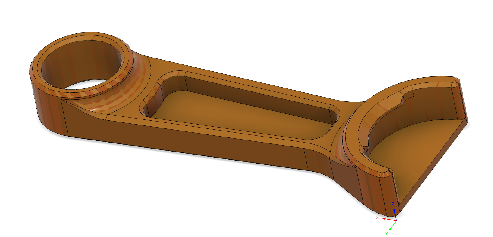
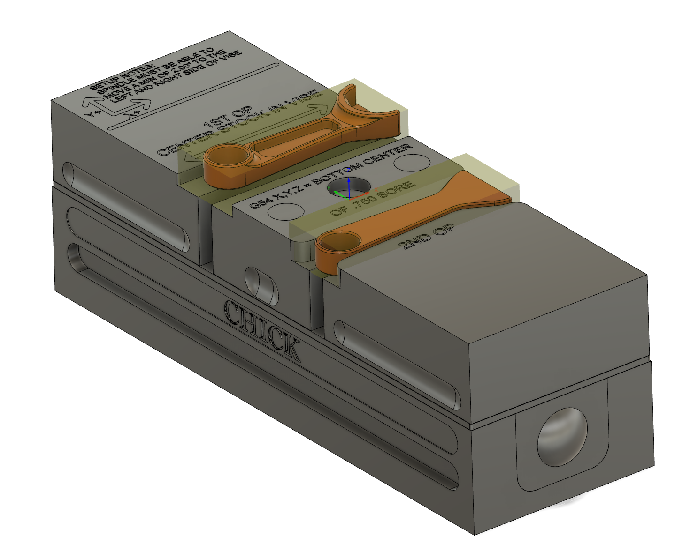

# Toolpath's Fusion Resources 

This is a collection of general resources to help you use Autodesk Fusion for CAM more efficiently and effectively. 

## Sample Parts for Tim's Geek Tips

[Tim Paul](https://www.instagram.com/oneeartim/) has a [series of tutorial videos](https://www.youtube.com/playlist?list=PLcocll3ju6rRrETrExgh74gx3VYsOm-d0) with very good tips on how to use Fusion effectively to program your parts for CNC machining. 

These are the sample parts he uses in those videos. 

### Bottle Opener

[Bottle Opener Part](https://raw.githubusercontent.com/toolpath/fusion_resources/main/sample_parts/Bottle%20Opener%20Chamfer%20Time.f3d
)

[Bottle Opener CAM](https://raw.githubusercontent.com/toolpath/fusion_resources/tree/main/sample_parts/Bottle%20Opener%20CAM%20Assm.f3d
)

